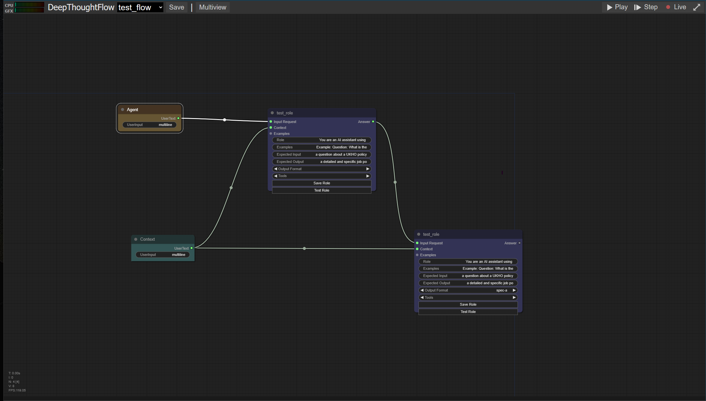
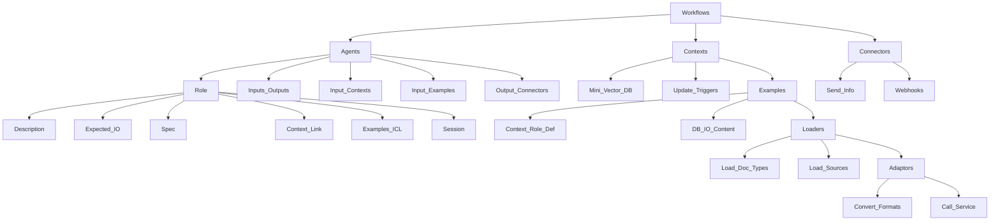

# DeepThoughtAI (DTAI)

A flexible open source distributed agentic framework designed to work at scale in business production workflow settings. 
The framework aims to allow users to specifiy fully orchestrated agentic flows without using any code.

<h1>Distributed functional agentic framework</h1>

 
<i>"Deep Thought announced that the new machine would be so large, it would resemble a planet, and be of such complexity that organic life itself would become part of its operating matrix."  - Douglas Adams, Hitch Hikers Guide To The Galaxy<i>  

# DeepThought Flow

# Features

* Code free AI agentic framework to orchestrate business flows in production
* Fully deployable locally or at scale in the cloud
* Serverless implementation
* Agentic core supporting:
    * Multi-RAG - RAG micro knowledge base per role
    * In context (multi-shot) Learning  - using semantic or lexical similarity
    * Multi-agent session learning
    * Using tools (API calling)
    * Using specs (output specification formatting)
    * Multi LLM support (LLM defined on a per role)
* GUI to help specify contextual and agentic flows
* HTML, PDF & Github import tools
* Full API to integrate with other systems/tools
* Backed by a distributed scalable database backend (ElasticSearch/CosmosDB)
* RAG search strategies can be lexical, semantic (vectorised), ontological (coming soon) and hybrid search strategies over RAG data

# Aims

* No code agentic flows
* Self documenting flows
* Observable - logging/monitoring
* Testable flows
* Deployable A/B
* Secure
* Open Source
* Serverless
* Framework will support the latest algorithmic understanding necessary to achieve best performance

> [!IMPORTANT]  
<bold>
This project is currently in a very early development/experimental stage.  
</bold>

# Examples

Policy chatbot 
Notice to mariners 
Job posting agent 

## Architecture notes

# Workflows

have:

* <bold>Agents</bold>
* <bold>Contexts</bold>
* <bold>Connectors</bold>

# Agents

* Are defined as having a specific <bold>Role</bold>
* have inputs or outputs to/from other <bold>Agents</bold> 
* can have input <bold>Contexts</bold>
* can have input <bold>Examples</bold>
* can have output <bold>connectors</bold>

# Roles

* Role description, expected input, expected output
* Optional <Bold>Spec</Spec> - also known as a function call
* options link to a <bold>Context</bold> also known as Long Term Memory (LTM)
* <bold>Examples</bold> (in context learning) either simple text or from a RAG context
* Session for Short Term Memory (STM)

# Contexts (Domain knowledge)

* have loaders (document loaders)
* are a type of mini vector DB
* can be triggered to update

# Loaders

* Load different types of documents e.g. pdf, text, xls etc
* Load from different sources e.g. S3 directory, github recursive
* Can have adaptors

# Adaptors

* Adaptors convert from one file format to another e.g. HTML to TEXT
* Adaptors can call a service to convert from MP3 to TEXT

# Examples (In Context Learning)

* are a kind of <bold>Context<bold> but for a specific role definition
* Can be a large database of input vs answer format content

# Specs (function call definition)

* Describes a function to call and the specification for all the parameters
* Can also describe a JSON schema

# Connectors

* send recevied information to external services 
* Are webhooks