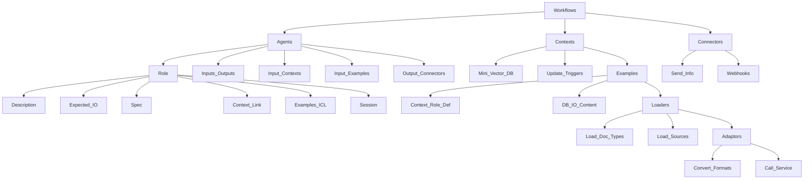

# DeepThoughtAI (DTAI)

A flexible open source agentic framework designed to work in business production workflow settings. 
The framework aims to allow users to specifiy fully orchestrated agentic flows without using any code.

<h1>Functional agentic framework</h1>

 
<i>"Deep Thought announced that the new machine would be so large, it would resemble a planet, and be of such complexity that organic life itself would become part of its operating matrix." - Douglas Adams, Hitch Hikers Guide To The Galaxy</i>  

# Features

* Code free AI agentic framework to orchestrate business flows in production
* Fully deployable locally or at scale in the cloud
* Agentic core supporting:
    * Multi-RAG - RAG micro knowledge base per role
    * In context (multi-shot) Learning  - using semantic or lexical similarity
    * Multi-agent session learning
    * Using tools (API calling)
    * Using specs (output specification formatting)
    * Multi LLM support (LLM defined on a per role)
* GUI to help specify contextual and agentic flows
* HTML, PDF & Github import tools
* Full API to integrate with other systems/tools

# Agent Features

* RAG Support 
* Assistant mode (context shared across multiple calls)
* Multi-Agent session learning (context shared across multiple class and agents)
* Function calling support (use templated formats to make calls to tools or other agents)
* Multi-shot learning (examples provide guideance for the AI)
* Reflective queries (system prompts enhance output without user intervention)
  * Support multi-hop strategies
* JSON Output formatting (generate or expect data based on defined schemas)
* Change LLM model on a per agent basis (to save cost use the best LLM agents only when needed)
* Multi-tenant support for user, tenants, roles, specs, tools, contexts

# Technical notes

* Azure functions to support all crud operations
* Experimental frontend gui developed in javascript/canvas (deployed as static web app - uses the function back end API)

# VectorDB Integrations

CosmosDB (custom vector DB implementation) 
ElasticCloud 

# LLM Integrations

OpenAI 
Anthropic(in testing) 
Ollama (local) 
GroqCloud 

> [!IMPORTANT]  
<bold>
This project is currently in a very early development/experimental stage.  
</bold>

# Examples

Policy chatbot
Notice to mariners
Job posting agent

# TODO:

* Self learning role/tool/specifications 
* Build a message routing framework 

Done:

<Strike>Add support for Anthropic</strike>
<Strike>Optional secrets now come from user account</strike>
<Strike>RAG import from github repo</strike>
<strike>role CRUD definitions to system, tenant or user</strike>
<Strike>specs CRUD (system, tenant userid)</strike>
<Strike>tools CRUD (system, tenant userid)</strike>
<Strike>flow CRUD (system, tenant, user)</strike>
<strike>* Multi-tenant support added to database and functions </strike>
<Strike>* Support multiple users </strike>
<strike>* Security - Added auth API to ensure secrets are not needed to be stored browser side </strike>
<strike>* Security - Added rate limiting to the API </strike>
<strike>* Security - Added request balance </strike>
<strike>* Initial flow client created </strike>
<strike>* Moved user options into DB </strike>
<strike>* Implemented JWT token auth scheme </strike>
<strike>* Security- Origin checks on requests </strike>
<strike>* fix the ollama sdk to support function calling </strike>
<Strike>* Local cosmodb init is slow ...  </strike>
<strike>* develop a job posting agent demo </strike>
<Strike>* agent input expectation for multihop questions </strike>
<Strike>* Improved LLM prompting i.e. system prompt, context, tools, examples  </strike>
<Strike>* Support JSON schema specification LLM outputs </strike>
<strike>* LLM Model overrides from templates e.g. change the llm model based on the role </strike>
<Strike>* rework <b>function calling</b> - now known as tools </strike>
<Strike>* Add support for Grok </strike>
<strike>* Add support for local AI model - LLama3 - DONE </strike>
<strike>* Add support for a local and cloud vector/nosql database option - CosmosDB - DONE </strike>
<strike>* Support <b>RAG</b>  </strike>
<strike>* Support <b>session memory</b> (Feature)  </strike>

## Architecture notes

# Workflows

have:

* <bold>Agents</bold>
* <bold>Contexts</bold>
* <bold>Connectors</bold>

# Agents

* Are defined as having a specific <bold>Role</bold>
* have inputs or outputs to/from other <bold>Agents</bold> 
* can have input <bold>Contexts</bold>
* can have input <bold>Examples</bold>
* can have output <bold>connectors</bold>

# Roles

* Role description, expected input, expected output
* Optional <Bold>Spec</Spec> - also known as a function call
* options link to a <bold>Context</bold> also known as Long Term Memory (LTM)
* <bold>Examples</bold> (in context learning) either simple text or from a RAG context
* Session for Short Term Memory (STM)

# Contexts (Domain knowledge)

* have loaders (document loaders)
* are a type of mini vector DB
* can be triggered to update

# Loaders

* Load different types of documents e.g. pdf, text, xls etc
* Load from different sources e.g. S3 directory, github recursive
* Can have adaptors

# Adaptors

* Adaptors convert from one file format to another e.g. HTML to TEXT
* Adaptors can call a service to convert from MP3 to TEXT

# Examples (In Context Learning)

* are a kind of <bold>Context<bold> but for a specific role definition
* Can be a large database of input vs answer format content

# Specs (function call definition)

* Describes a function to call and the specification for all the parameters
* Can also describe a JSON schema

# Connectors

* send recevied information to external services 
* Are webhooks