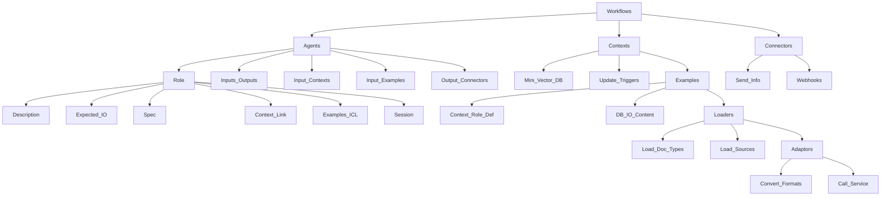

# DeepThought

Functional agentic framework


<br>
"Deep Thought announced that the new machine would be so large, it would resemble a planet, and be of such complexity that organic life itself would become part of its operating matrix." - Douglas Adams, Hitch Hikers Guide To The Galaxy

# Features

* Code free AI agent framework to orchestrate business flows
* Fully deployable locally or at scale in the cloud
* Recursive agent implementation with Domain Speciifc Language (DSL) built into the template
* Support for context based search (RAG)
* Dynamic workflow between agents

# Agent Features

* RAG Support 
* Assistant mode (context shared across multiple calls)
* Multi-Agent session learning (context shared across multiple class and agents)
* Function calling support (use templated formats to make calls to tools or other agents)
* Multi-shot learning (examples provide guideance for the AI)
* Reflective queries (system prompts enhance output without user intervention)
  * Support multi-hop strategies
* JSON Output formatting (generate or expect data based on defined schemas)
* Change LLM model on a per agent basis (to save cost use the best LLM agents only when needed)


# VectorDB Integrations

ElasticCloud<br>
CosmosDB (custom vector DB implementation)<br>

# LLM Integrations

OpenAI<Br>
Ollama (local)<br>
GroqCloud<br>

# Demo


Job posting agent


> [!IMPORTANT]  
<bold>
This project is currently in a very early development/experimental stage. <br/>
There are a lot of unimplemented/broken features at the moment. <br/>
</bold>

# Terminology

Functions/Tools - 3rd party functions to perform specific tasks e.g. scrape a web page etc
Specification - Used to define the JSON output format from an AI conversation (not used like 'functions')

# Examples


## Example request


## Update roles database

```
python roles/update_roles.py "<path-to-roles-directory>"
```

## Update tools database

```
python tools/update_tools.py "<path-to-tools-directory>"
```

# TODO:


Workflow:

Function orchestration

MVP:

UserSettings:
we need all user keys to be stored in the user settings object

Tests:

Need a test framework


Tools:

RAG from PDF, TXT files, Website
UI:


Docs:

* Fully local run installation instructions<br/>

System:


<br/>
* user level flows, roles, tools and specs<br/>
* system level flows, roles, tools and specs<br/>

Problems:


Features:

* allow all role fields to be overriden from input<br>

* Self learning role/tool/specifications 
* Build a message routing framework<br>
* develop a multie role agent demo<br>

Client:

* Add client side calls to the server API

Installation:

* Create a local docker version

Done:

<strike>role CRUD definitions to system, tenant or user</strike>
<Strike>specs CRUD (system, tenant userid)</strike>
<Strike>tools CRUD (system, tenant userid)</strike>
<Strike>flow CRUD (system, tenant, user)</strike>
<strike>* Multi-tenant support added to database and functions<br/></strike>
<Strike>* Support multiple users<br/></strike>
<strike>* Security - Added auth API to ensure secrets are not needed to be stored browser side<br></strike>
<strike>* Security - Added rate limiting to the API<br></strike>
<strike>* Security - Added request balance<br></strike>
<strike>* Initial flow client created<br></strike>
<strike>* Moved user options into DB<br></strike>
<strike>* Implemented JWT token auth scheme<br></strike>
<strike>* Security- Origin checks on requests<br></strike>
<strike>* fix the ollama sdk to support function calling<br></strike>
<Strike>* Local cosmodb init is slow ... <br></strike>
<strike>* develop a job posting agent demo<br></strike>
<Strike>* agent input expectation for multihop questions<br></strike>
<Strike>* Improved LLM prompting i.e. system prompt, context, tools, examples <br></strike>
<Strike>* Support JSON schema specification LLM outputs<br></strike>
<strike>* LLM Model overrides from templates e.g. change the llm model based on the role<br></strike>
<Strike>* rework <b>function calling</b> - now known as tools<br></strike>
<Strike>* Add support for Grok<br/></strike>
<strike>* Add support for local AI model - LLama3 - DONE<br></strike>
<strike>* Add support for a local and cloud vector/nosql database option - CosmosDB - DONE<br></strike>
<strike>* Support <b>RAG</b> <br></strike>
<strike>* Support <b>session memory</b> (Feature) <br></strike>


# Installation

Download and install Azure Core Tools runtime (Python)

https://learn.microsoft.com/en-us/azure/azure-functions/functions-run-local?tabs=windows%2Cisolated-process%2Cnode-v4%2Cpython-v2%2Chttp-trigger%2Ccontainer-apps&pivots=programming-language-python

For VSCode install the Azure Functions extension: ms-azuretools.vscode-azurefunctions
For local running you will also need to install Azurite Blob Serive (running on port 10000)

## Download and install CosmoDB emulator

https://learn.microsoft.com/en-us/azure/cosmos-db/how-to-develop-emulator?tabs=windows%2Ccsharp&pivots=api-nosql
https://aka.ms/cosmosdb-emulator (takes a few minutes to start)

### data explorer:

https://localhost:8081/_explorer/index.html


## Queue storage

Account name: devstoreaccount1
Account key: Eby8vdM02xNOcqFlqUwJPLlmEtlCDXJ1OUzFT50uSRZ6IFsuFq2UVErCz4I6tq/K1SZFPTOtr/KBHBeksoGMGw==


## LLM 

OLLAMA installation:<br>

https://ollama.com/download

Install a model e.g.  llama3:<br>

https://ollama.com/library/llama3


## Configuration of services and keys

Setup the secret tokens in the local.settings.json file:

{
  "IsEncrypted": false,
  "Values": {
    "AzureWebJobsStorage": "UseDevelopmentStorage=true",
    "FUNCTIONS_WORKER_RUNTIME": "python",
    "AzureWebJobsFeatureFlags": "EnableWorkerIndexing",

    "ELASTIC_CLOUD_ID":"<CloudId>",
    "ELASTIC_API_KEY":"<ApiKey>",
    "ES_INDEX":"embedding_test_index",
    "ES_INDEX_ROLES": "deepthought_roles",
    "ES_INDEX_HISTORY": "deepthought_history",
    "ES_INDEX_TOOLS": "deepthought_tools",
    "ES_NUM_DOCS": "5",

    "LLM_TYPE":"openai",
    "OPENAI_API_KEY":"<your api key for open-ai>",
    "OPENAI_MODEL":"gpt-4-turbo-preview",
    "EMBEDDING_MODEL":"text-embedding-3-small",
    "MAX_SESSION_TOKENS": "4096"
  }
}

## running (see .vscode/settings.json)

.venv\Scripts\activate ; func host start 

## other tools

Installation of mqttx app (https://mqttx.app/) for local testing 


## Architecture notes





# Workflows

have:

* <bold>Agents</bold>
* <bold>Contexts</bold>
* <bold>Connectors</bold>

# Agents

* Are defined as having a specific <bold>Role</bold>
* have inputs or outputs to/from other <bold>Agents</bold> 
* can have input <bold>Contexts</bold>
* can have input <bold>Examples</bold>
* can have output <bold>connectors</bold>

# Roles

* Role description, expected input, expected output
* Optional <Bold>Spec</Spec> - also known as a function call
* options link to a <bold>Context</bold> also known as Long Term Memory (LTM)
* <bold>Examples</bold> (in context learning) either simple text or from a RAG context
* Session for Short Term Memory (STM)

# Contexts (Domain knowledge)

* have loaders (document loaders)
* are a type of mini vector DB
* can be triggered to update

# Loaders

* Load different types of documents e.g. pdf, text, xls etc
* Load from different sources e.g. S3 directory, github recursive
* Can have adaptors

# Adaptors

* Adaptors convert from one file format to another e.g. HTML to TEXT
* Adaptors can call a service to convert from MP3 to TEXT

# Examples (In Context Learning)

* are a kind of <bold>Context<bold> but for a specific role definition
* Can be a large database of input vs answer format content

# Specs (function call definition)

* Describes a function to call and the specification for all the parameters
* Can also describe a JSON schema

# Connectors

* send recevied information to external services 
* Are webhooks