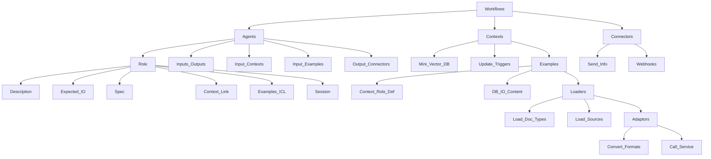

## Architecture notes

# Workflows

have:

* <bold>Agents</bold>
* <bold>Contexts</bold>
* <bold>Connectors</bold>

# Agents

* Are defined as having a specific <bold>Role</bold>
* have inputs or outputs to/from other <bold>Agents</bold> 
* can have input <bold>Contexts</bold>
* can have input <bold>Examples</bold>
* can have output <bold>connectors</bold>

# Roles

* Role description, expected input, expected output
* Optional <Bold>Spec</Spec> - also known as a function call
* options link to a <bold>Context</bold> also known as Long Term Memory (LTM)
* <bold>Examples</bold> (in context learning) either simple text or from a RAG context
* Session for Short Term Memory (STM)

# Contexts (Domain knowledge)

* have loaders (document loaders)
* are a type of mini vector DB
* can be triggered to update

# Loaders

* Load different types of documents e.g. pdf, text, xls etc
* Load from different sources e.g. S3 directory, github recursive
* Can have adaptors

# Adaptors

* Adaptors convert from one file format to another e.g. HTML to TEXT
* Adaptors can call a service to convert from MP3 to TEXT

# Examples (In Context Learning)

* are a kind of <bold>Context<bold> but for a specific role definition
* Can be a large database of input vs answer format content

# Specs (function call definition)

* Describes a function to call and the specification for all the parameters
* Can also describe a JSON schema

# Connectors

* send recevied information to external services 
* Are webhooks